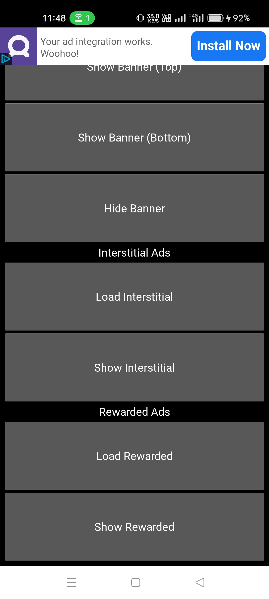
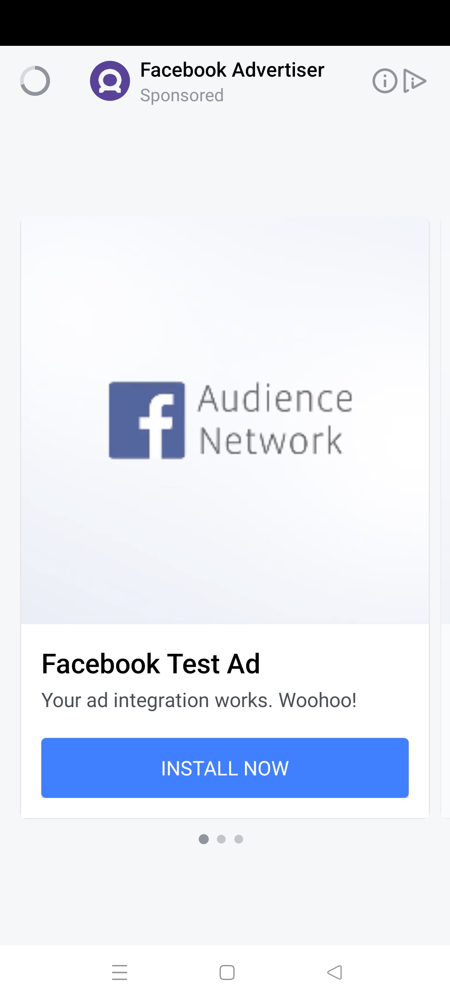
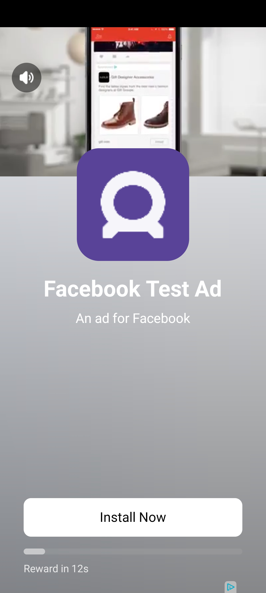

# Meta4Kivy: Meta (Facebook) Ads Integration for Kivy (Python-for-Android)

# Author

### Created by SK Sahil (https://github.com/Sahil-pixel)  
Inspired by AdMob4Kivy — bringing Meta Ads to Python for Android.


🚀 First working Meta (Facebook) Ads integration for Kivy Android using Pyjnius  
Supports Banner, Interstitial, and Rewarded Video Ads with event callbacks

---

## 📱 Features

- Show/Hide Banner Ads (Top or Bottom)
- Load and Show Interstitial Ads
- Load and Show Rewarded Ads
- Event callbacks:
  - ad_loaded
  - ad_error
  - ad_clicked
  - ad_impression
  - interstitial_dismissed
  - rewarded_completed
  - rewarded_dismissed

---

## 🧠 How It Works

- Java SDK is wrapped using Pyjnius
- Event handling is done using a Java interface `MetaAdListener` implemented in Python
- All ad UI methods run on the Android UI thread via `@run_on_ui_thread`

---

## 📦 File Structure

📁 java_code/  
  ├── MetaAdManager.java  
  └── MetaAdListener.java  
📄 meta4kivy.py  
📄 main.py  
📄 buildozer.spec

---

## 🛠 Setup
```
Buildozer 1.5.0
p4a Version	2024.01.21 (commit 957a3e5f) (master)
NDK r25b
Java	OpenJDK 17
```

1. Place Java files inside `java_code/`

2. Edit your `buildozer.spec`:

(Make Local Copy On Your Project)

```ini
android.add_src = ./java_code
android.permissions = INTERNET, ACCESS_NETWORK_STATE
android.enable_androidx = True
android.meta_data = com.facebook.sdk.ApplicationId=YOUR_FACEBOOK_APP_ID
android.gradle_dependencies = com.facebook.android:audience-network-sdk:6.+
```

3. Replace test placement IDs in `main.py`:

```python
##Create Meta Ads Account to Get IDS 
APP_ID = "YOUR_FACEBOOK_APP_ID"
BANNER = "YOUR_BANNER_PLACEMENT_ID"
INTERSTITIAL = "YOUR_INTERSTITIAL_PLACEMENT_ID"
REWARDED = "YOUR_REWARDED_PLACEMENT_ID"
```
4. Example

```python
from kivy.app import App
from kivy.lang import Builder
from kivy.uix.boxlayout import BoxLayout
from meta4kivy import MetaAdManager

APP_ID = "YOUR_FACEBOOK_APP_ID"
BANNER = "YOUR_BANNER_PLACEMENT_ID"
INTERSTITIAL = "YOUR_INTERSTITIAL_PLACEMENT_ID"
REWARDED = "YOUR_REWARDED_PLACEMENT_ID"

KV = '''
<MetaTestUI>:
    orientation: 'vertical'
    padding: 20
    spacing: 10

    Button:
        text: "Show Banner (Top)"
        on_press: app.show_banner(True)

    Button:
        text: "Show Banner (Bottom)"
        on_press: app.show_banner(False)
    Button:
        text: "Hide Banner"
        on_press: app.hide_banner()

    Label:
        text: "Interstitial Ads"
        size_hint_y: None
        height: dp(20)

    Button:
        text: "Load Interstitial"
        on_press: app.load_interstitial()

    Button:
        text: "Show Interstitial"
        on_press: app.show_interstitial()

    Label:
        text: "Rewarded Ads"
        size_hint_y: None
        height: dp(20)

    Button:
        text: "Load Rewarded"
        on_press: app.load_rewarded()

    Button:
        text: "Show Rewarded"
        on_press: app.show_rewarded()
'''


class MetaTestUI(BoxLayout):
    pass


class MetaTestApp(App):
    def build(self):
        self.meta_ads = MetaAdManager(callback=self.ad_callback)
        Builder.load_string(KV)
        return MetaTestUI()

    def show_banner(self, top=True):
        self.meta_ads.show_banner(BANNER, top=top)

    def hide_banner(self):
        self.meta_ads.hide_banner()

    def load_interstitial(self):
        self.meta_ads.load_interstitial(INTERSTITIAL)

    def show_interstitial(self):
        self.meta_ads.show_interstitial()

    def load_rewarded(self):
        self.meta_ads.load_rewarded(REWARDED)

    def show_rewarded(self):
        self.meta_ads.show_rewarded()

    def ad_callback(self, event, *args):
        print("Event IN Kivy App :", event, args)


if __name__ == '__main__':
    MetaTestApp().run()

```

## 📷 Screenshot

Here's what the app looks like on Android:
<p align="center">
  
  
  
</p>

[![Watch the video]](https://youtube.com/shorts/wycBUocEL_Y?si=e7IrmuS9uoE58Nle)


---

## 🧪 Sample Output

```
[Meta4Kivy] [BANNER] Ad Loaded
[Meta4Kivy] [INTERSTITIAL] Error: No fill
[Meta4Kivy] [REWARDED] Ad Clicked
Event IN Kivy App : ad_clicked ('REWARDED',)
```

---

## Pay for Support

If you find this project helpful and want to support development, you can donate for support:

-  [](https://ko-fi.com/sahilpixel)
  
- [](https://paypal.me/SKSAHILIN?country.x=IN&locale.x=en_GB)


Thank you for your support!


---

## 📃 License

MIT License
